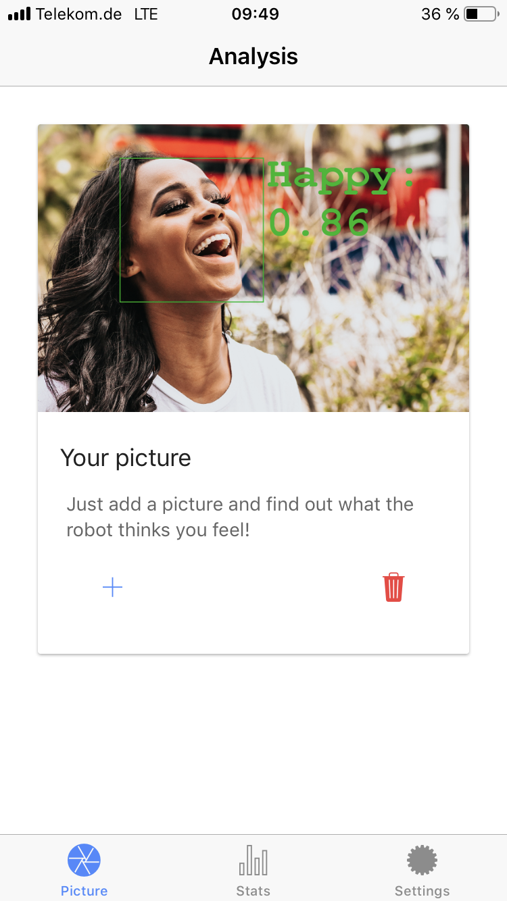
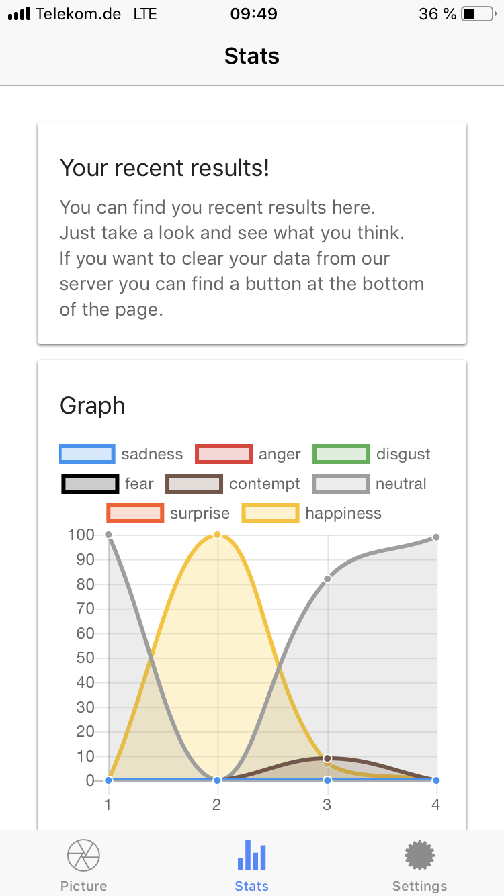

# hAPPy

Welcome to the frontend of the hAPPy project.
This is a project done for the class 'Web-Engineering II' at the DHBW Stuttgart.

## Table of Contents


1. [Getting Started](#getting-started)
2. [Architecture](#architecture)
3. [Pages](#pages)
4. [Providers](#providers)
5. [Example Screenshots](#examle-screenshots) 

## <a name="getting-started"></a>Getting Started

To start developing clone this project and install the latest version of the Ionic CLI then run:

```bash
npm i -g ionic
npm install
ionic serve hAPPy -l
```

For device testing enter

```bash
ionic cordova run android/ios
```

## <a name="architecture"></a>Architecture

The architecture of this app follows the standard ionic architecture arche-type.
It differentiates between pages (the views of the app) and provideres (services which work with data).

## <a name="pages"></a>Pages

This project is divided into multiple pages.

### About

This page displays all kind of information about data protection and the imprint.

### Analysis

This page displays the result of the picture analysis by drawing a chart.

### Login

The Login-Page lets you login to an existin account by posting the information to the login endpoint of the backend.
On successful login:
While login in the user gets authenticated and a jwt token is stored in the app.
It will push the view to display the Picture-Page.

### Password-Reset

A page which is displayed when the user enters a temporary password which he was given because he requested a password reset.

### Password-Reset-Email

This page is displayed when the user asks for a password reset in the login page.

### Picture

The Picture-Page lets you upload an image to be analysed.
It will display the result of the analysis.

### Register

### Settings

The Settings-Page will let you choose between some basic settings, like changing your user name, loging out and deleting an account.

### Stats

The Stats-Page will display additional information about the last analysed images.
It uses the chart.js library to display this information.

### Tabs

The parent View for the Picture-, Statistics- and Settings-Page.
It lets you switch betweent the Pages.

### Welcome

The Welcome-Page is the entry point to the app from the users perspective.
The Welcome-Page lets you choose between the SignUp- and Login-Page.

## <a name="providers"></a>Providers

The data-services of this app.

### Api-Service

A wrapper for a standard api.
It implements the GET-, POST-, PUT-, DELETE- and PATCH-Methods.
Altough not alle methods are used at this point in time they are still implemented for consistency and future developement.

### Back-Button

This file provides functionality to override the back button of android and windows phones.

### Face-Service

This service parses the analysis object provided by the backend and stores the result.

### User-Service

This service represents the user and their data.
It provides methods for loging in, signing up and loging out.

### Utils-Folder

A folder full of services which had no other place.

#### Form-Validation

this file provides a service which validates if passwords are the same and also if the length of the password is atleast 8 characters.
It also provides a service for validating email.

#### Strings

All strings are stored and exported here to keep all the others files more tidy.

#### Utils

This file provides services for navigating and at the same time setting a new root and also one for making toasts easier to display.

## <a name="examle-screenshots"></a>Screenshots

The app looks somewhat like this:





